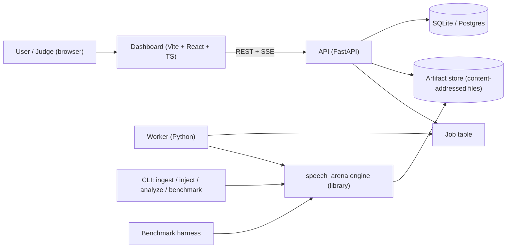
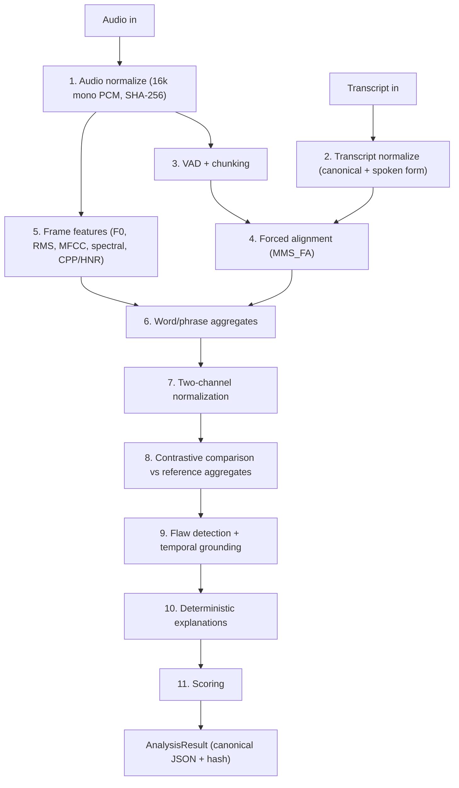
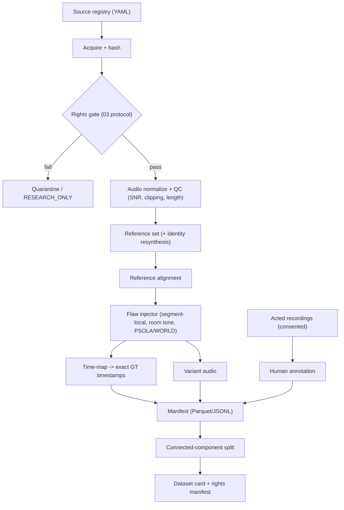

# Speech Arena: Architecture (Hackathon MVP)

| Field | Value |
| --- | --- |
| Version | 0.1 |
| Date | 2026-10-06 |
| Binding decisions | `docs/20-ENGINEERING-REVIEW.md` §7 (ADR-001 … ADR-012) |
| Production / post-hackathon reference | `docs/17-DEVOPS.md`, `docs/19-RELEASE.md` (not used for MVP) |

---

## 1. Design Principles

1. **Pure, versioned pipeline.** Each stage is a pure function `(inputs, config) → artifact`. Artifacts are content-addressed and cached.
2. **The engine is a library first.** `packages/speech_arena` runs from the CLI, the worker and the benchmark harness. The API and UI are thin layers on top.
3. **Contrastive by construction.** Every analysis takes a `(reference, participant, transcript)` triple (Invariant 1, doc 00).
4. **Alignment-anchored.** Comparison happens per word and per phrase, never per raw frame (ADR-002).
5. **Deterministic.** CPU path is the default. Seeds are fixed. Results are serialized canonically (ADR-012, M14).
6. **Local-first.** One `docker compose up`. No cloud dependencies (ADR-009).

---

## 2. System Context



- **Job queue = DB-backed job table** polled by the worker. It works natively on Windows (RQ/Celery need fork, Redis is extra). It can be swapped for Redis/RQ later behind the same interface.
- **SSE** (Server-Sent Events) streams stage progress to the UI.

---

## 3. Analysis Pipeline



| # | Stage | Module | Key tech | Output artifact |
| --- | --- | --- | --- | --- |
| 1 | Audio normalize | `audio.io` | ffmpeg, soundfile | `audio/<sha>.wav` |
| 2 | Transcript normalize | `text.normalize` | regex, `num2words` | `Transcript{canonical_words[], spoken_words[], punct[]}` |
| 3 | VAD + chunking | `audio.vad` | Silero VAD (ONNX, deterministic) | `vad.json` (speech segments) |
| 4 | Forced alignment | `align.mms` | `torchaudio.pipelines.MMS_FA`, `forced_align` | `alignment.json` (word start/end/conf) |
| 5 | Frame features | `features.frame` | parselmouth (F0, HNR, CPP), librosa (RMS, MFCC, spectral) | `features.parquet` @ 10 ms hop |
| 6 | Aggregates | `features.units` | numpy | `units.parquet` (per word + phrase) |
| 7 | Normalization | `normalize` | ADR-001 | columns `*_st`, `*_db_rel`, `*_z` |
| 8 | Comparison | `compare` | per-unit deltas, ratios | `deltas.parquet` |
| 9 | Grounding | `ground.<flaw>` | per-flaw detectors, run merging | `Flaw[]` |
| 10 | Explanation | `explain` | Jinja2 templates + approved dictionary | `Flaw.explanation` |
| 11 | Scoring | `score` | versioned YAML weights | `Score{total, buckets, deductions[]}` |

**Reference caching:** stages 1–7 for a reference run once and are keyed by `(audio_sha, transcript_version, config_hash)`. Participant analysis then only runs its own stages 1–7, plus 8–11.

---

## 4. Dataset Engineering Pipeline



**Injector contract (ADR-003):**
```text
inject(ref_audio, ref_alignment, flaw_type, severity, target_span, seed)
  -> variant_audio, time_map[(t_ref, t_var)...], injected_interval, params{}
```
- `params` maps one-to-one to severity through `configs/severity/<flaw>.yaml`.
- References go through `resynth(identity)` so that references and variants share the same processing artifacts.

---

## 5. Core Data Contracts (Pydantic v2 → JSON Schema in `packages/schemas`)

### 5.1 `Flaw`
```json
{
  "flaw_id": "sha1(analysis_id|type|start|end)",
  "type": "PACING_TOO_FAST",
  "bucket": "pacing",
  "start_time": 21.40,
  "end_time": 25.80,
  "transcript_span": {"start_word": 14, "end_word": 21, "text": "we cannot dedicate we cannot consecrate"},
  "evidence": {
    "metric": "syllables_per_second",
    "reference_value": 3.80,
    "participant_value": 5.10,
    "delta_abs": 1.30,
    "delta_rel": 0.342,
    "formula": "(participant - reference) / reference"
  },
  "severity": 0.55,
  "confidence": 0.93,
  "explanation": {"fact": "...", "interpretation": "...", "action": "...", "template_id": "pacing_fast.v1"},
  "penalty": 4.12
}
```

### 5.2 `AnalysisResult`
```json
{
  "schema_version": "1.0",
  "inputs": {"reference_sha": "...", "participant_sha": "...", "transcript_id": "...", "transcript_version": "..."},
  "versions": {"feature": "f1.0", "alignment": "mms_fa@<ver>", "normalization": "n1.0",
               "grounding": "g1.0", "scoring": "s1.0", "config_hash": "...", "code_commit": "...", "env": "..."},
  "alignment": {"participant": [{"word": "Four", "start": 0.12, "end": 0.45, "confidence": 0.99}]},
  "flaws": [],
  "score": {"total": 82.4, "buckets": {"pacing": -6.1, "pitch": -4.0, "pauses": -3.5, "energy_clarity": -4.0}},
  "series_ref": "series/<hash>.parquet"
}
```
- **Canonical serialization:** keys sorted, floats rounded (times to 3 decimals, stats to 4), UTF-8, `\n` line endings. `result_hash = sha256(canonical_json)`.
- Wall-clock time, job ID and UUIDs live **outside** the hashed payload (in the DB row).

### 5.3 Dataset record
This is doc 04 §4 plus `time_map_path`, `resynth_chain`, `severity_params`, `inserted_tokens[]`, `source_kind (injected | acted | clean)`, `consent_id`, `split_component_id`.

---

## 6. Repository Layout

```text
speech-arena/
├── AGENTS.md                  # agent rules: read SESSION_LOG first
├── PRD.md  ROADMAP.md  ARCHITECTURE.md  SESSION_LOG.md  README.md
├── docs/                      # 00–20 specs (20 = binding review)
├── packages/
│   ├── speech_arena/          # core engine (pure Python library)
│   │   ├── audio/  text/  align/  features/  normalize/
│   │   ├── compare/  ground/  explain/  score/  inject/
│   │   ├── io/ (artifact store, canonical json)  versioning.py
│   │   └── cli.py
│   └── schemas/               # pydantic models + exported JSON Schema + TS types
├── services/
│   ├── api/                   # FastAPI app (routes, SSE, DB models)
│   └── worker/                # job runner wrapping the engine
├── apps/
│   └── dashboard/             # Vite + React + TS, wavesurfer.js, uPlot, Zustand
├── datasets/
│   ├── registry/sources.yaml  # every URL + status
│   ├── rights/                # per-asset rights manifests (03 schema)
│   ├── consent/               # consent records (no audio)
│   ├── raw/  normalized/  variants/   # git-ignored, DVC/manifest-tracked
│   └── manifests/             # dataset_vX.Y.parquet + card
├── configs/
│   ├── pipeline/default.yaml  # windows, hop, thresholds
│   ├── severity/<flaw>.yaml   # param <-> severity maps
│   ├── scoring/s1.0.yaml      # bucket caps, base weights
│   └── stress/suite.yaml
├── benchmarks/
│   ├── grounding/  classification/  stress/  ablations/  human_eval/
│   └── reports/               # generated tables (versioned)
├── tests/  (unit/ integration/ golden/ data_quality/)
├── docker/  (Dockerfile.engine, Dockerfile.dashboard)
├── docker-compose.yml
└── .github/workflows/ci.yml
```

---

## 7. Technology Stack

| Layer | Choice | Why |
| --- | --- | --- |
| Language | Python 3.11 (engine/API), TypeScript 5 (UI) | Doc 01 §4.5 typing mandate |
| Env lock | `uv` + `pyproject.toml` + `uv.lock`; `package-lock.json` | Fast, reproducible |
| Alignment | torchaudio MMS_FA (CPU default) | Pure PyTorch, multilingual, no Kaldi on Windows |
| Optional aligner | Montreal Forced Aligner (Docker profile) | Cross-check / ablation |
| F0 / voice quality | parselmouth (Praat) | Fast, standard, CPP/HNR |
| Spectral / MFCC / RMS | librosa | Doc 07 |
| Resynthesis | pyworld, parselmouth PSOLA | Clean, controllable injection |
| VAD | Silero VAD (ONNX) | Deterministic CPU |
| Storage | Parquet (pyarrow) + SQLite (Postgres optional) | Docs 07, 17 simplified |
| API | FastAPI + SQLAlchemy 2 + Pydantic v2 | Typed, auto OpenAPI |
| UI | Vite + React + TS, wavesurfer.js v7 (regions), uPlot (canvas), Zustand | 60 fps target (M13) |
| Quality | ruff, mypy, pytest, hypothesis; eslint, prettier, vitest | |
| CI | GitHub Actions: lint → type → test → golden-hash → docker build | |

---

## 8. Configuration and Versioning (ADR-012)

- Every threshold lives in YAML. `config_hash = sha256(canonical(merged_config))`.
- Each stage has a semantic version string in code (`FEATURE_VERSION = "f1.0"`). Bump it whenever output can change.
- The dataset version is the manifest file hash plus a SemVer tag.
- **Golden tests:** a small fixed audio set whose `result_hash` is pinned in `tests/golden/`. CI fails on drift unless a version bump accompanies it.

---

## 9. Deployment (ADR-009)

```yaml
# docker-compose.yml (sketch)
services:
  api:       { build: docker/Dockerfile.engine, command: uvicorn services.api.main:app, ports: ["8000:8000"] }
  worker:    { build: docker/Dockerfile.engine, command: python -m services.worker }
  dashboard: { build: docker/Dockerfile.dashboard, ports: ["5173:80"] }
  benchmark: { build: docker/Dockerfile.engine, command: python -m benchmarks.run_all, profiles: ["bench"] }
```
- Model weights are pre-downloaded into the image at build time, pinned by revision hash.
- GPU profile is optional (`profiles: ["gpu"]`). The CPU result is the reproducibility reference.

---

## 10. Documentation Architecture (MD map)

| File | Role | Owner of truth for |
| --- | --- | --- |
| `AGENTS.md` | Always-on agent rules | Session protocol |
| `SESSION_LOG.md` | Append-only conversation/decision log | History, decisions, open questions |
| `PRD.md` | What and why | Requirements, scope, success metrics |
| `ARCHITECTURE.md` | How (system level) | Components, contracts, stack, layout |
| `ROADMAP.md` | When and in what order | Phases, milestones, task checklists |
| `docs/20-ENGINEERING-REVIEW.md` | Binding corrections + ADRs | Resolved conflicts |
| `docs/00`–`16` | Detailed module specs | Per-module detail (subject to doc 20) |
| `docs/17`–`19` | Post-hackathon production reference | Not used in MVP |
| `Speech_Master_Research_Build_Prompt.md` | Historical source input | — |

Precedence when documents conflict: **SESSION_LOG decisions (latest) > doc 20 > PRD/ARCHITECTURE > docs 00–19 > master prompt.**
