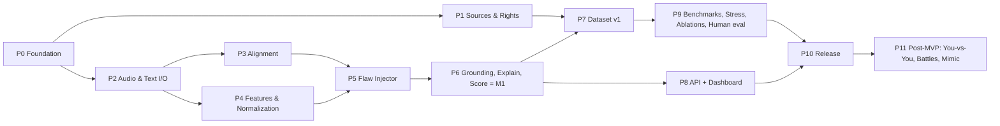

# Speech Arena: Roadmap

| Field | Value |
| --- | --- |
| Version | 0.1 |
| Date | 2026-10-06 |
| Deadline | **TBD (ask user)**. The phases are ordered by dependency; dates get filled in once the deadline is known |
| Rule | Build each phase's checklist completely before moving on. Tick boxes here and log progress in `SESSION_LOG.md` |

**North-star milestone (M1, from master prompt L318):**
> one speech → one controlled flawed version → exact temporal flaw → acoustic evidence → mathematical delta → human explanation → score

Only after M1 works end-to-end on the CLI do we scale the dataset, build the dashboard and add benchmarks.

---

## Phase Overview

| Phase | Goal | Judging criterion served | Est. effort |
| --- | --- | --- | --- |
| P0 | Repo, env, CI, configs, schemas | Reproducibility 10% | 0.5 day |
| P1 | Source registry + rights manifests | Data 30% | 1 day (parallel) |
| P2 | Audio/text normalization, VAD, QC | Data / Features | 0.5 day |
| P3 | Forced alignment | Grounding 25% | 1 day |
| P4 | Frame features + aggregates + two-channel normalization | Features 20% | 1.5 days |
| P5 | Flaw injector with time-maps | Data 30% | 1.5 days |
| P6 | Detection, grounding, explanation, scoring → **M1** | Grounding 25% | 2 days |
| P7 | Dataset v1 (scale, acted, splits, card) | Data 30% | 2 days |
| P8 | API + dashboard | Dashboard 15% | 2.5 days |
| P9 | Benchmarks, stress, ablations, human eval | Data/Stress 30%, Grounding | 2 days |
| P10 | Docs, demo, release | All | 1 day |
| P11 | Post-MVP gamification | — | after release |

---

## P0: Foundation
- [x] `git init`, `.gitignore` (data/, models/, .venv, node_modules)
- [x] Monorepo skeleton per `ARCHITECTURE.md` §6
- [x] `pyproject.toml` + `uv.lock` (Python 3.11); ruff, mypy, pytest configured
- [x] `packages/schemas`: `Flaw`, `AnalysisResult`, `Alignment`, `DatasetRecord`, `RightsManifest` (Pydantic v2) + JSON Schema export
- [x] `configs/pipeline/default.yaml`, `configs/scoring/s1.0.yaml`, config loader + `config_hash`
- [x] Canonical JSON writer + `result_hash`
- [x] Versioning module (stage versions, git commit, env info)
- [x] GitHub Actions CI (lint, type, test)
- [x] Dockerfile.engine (CPU) builds
- **Exit:** `uv run pytest` is green and `docker build` succeeds.

## P1: Sources and Rights (can run in parallel with P2–P4)
- [x] `datasets/registry/sources.yaml` holding every URL from doc 02 (fix mirror links → canonical)
- [x] Rights manifest per asset (doc 03 schema + consent fields)
- [x] Classify: VERIFIED / UNVERIFIED / RESEARCH_ONLY / REJECTED (TED → RESEARCH_ONLY)
- [x] Pick **3–5 high-confidence references** (PD/CC BY, with verified provenance)
- [x] Pick **one short transcript (~20–40 s)** for M1 (candidate: a Gettysburg excerpt, LibriVox PD reading)
- [x] Consent form template for team recordings
- **Exit:** M1 reference asset is VERIFIED with a complete manifest and SHA-256.

## P2: Audio and Text I/O
- [x] `audio.io`: load any format → 16 kHz mono s16 WAV (ffmpeg), SHA-256 of raw and normalized
- [x] QC: SNR estimate, clipping ratio, length bounds
- [x] `text.normalize`: canonical words + punctuation tags + spoken form (numbers, abbreviations)
- [x] Silero VAD → speech segments; chunking ≤ 30 s at pauses
- [x] Unit tests with synthetic tones/silence
- **Exit:** CLI `sa ingest <file> <transcript>` produces normalized artifacts.

## P3: Forced Alignment
- [x] MMS_FA aligner (CPU, deterministic), chunk-aware, word-level timestamps + confidence
- [x] Confidence definition (mean CTC posterior per word), calibrated on clean audio
- [x] Alignment JSON per doc 06 §5; pauses = inter-word gaps
- [x] Visual sanity check: export a Praat TextGrid
- [ ] Optional: MFA Docker profile for cross-check
- **Exit:** the M1 reference is aligned; spot-checked boundaries are within ±30 ms.

## P4: Features and Normalization
- [x] Frame features at a 10 ms hop: F0 (parselmouth, speaker-adaptive floor/ceiling), RMS/dB, MFCC-13, spectral centroid/rolloff/tilt, voicing
- [x] P1 features: CPP, HNR
- [x] Word/phrase aggregates: duration, syllables (CMUDict + fallback), local rate, following pause, ST mean/range, dB mean/range
- [x] ADR-001 two-channel normalization; raw + normalized columns in Parquet
- [x] Golden test: fixed audio → pinned Parquet hash
- **Exit:** `sa features <audio>` gives reproducible Parquet; monotone/low-energy stay detectable after normalization (unit test).

## P5: Flaw Injector
- [x] Identity resynthesis chain for references (WORLD / PSOLA)
- [x] Segment-local operators with crossfades, each emitting a **time-map**:
  - [x] pacing fast/slow (PSOLA time-scale on a word span)
  - [x] pause excessive/misplaced (room-tone insertion), pause missing (gap compression)
  - [x] pitch monotone (F0 variance compression), pitch instability (jitter/up-talk contour)
  - [x] energy low/excessive/abrupt (gain envelopes)
  - [x] P1: emphasis misplaced, clarity reduced (spectral smoothing/low-pass), hesitation (filler splice), multi-flaw
- [x] `configs/severity/<flaw>.yaml`: param ↔ severity maps
- [x] Ground-truth alignment for variants = reference alignment ∘ time-map
- [x] Listening check: each operator × 4 severities
- **Exit:** `sa inject` generates a variant + exact GT interval + params JSON.

## P6: Grounding, Explanation, Scoring → **M1**
- [x] Contrastive comparison of per-word deltas against the reference
- [x] Detectors: pacing (local rate ratio), pauses (gap matching at word boundaries), pitch (ST range ratio / instability), energy (dB-relative), each snapped to word boundaries
- [x] Confidence = f(alignment conf, voicing ratio, SNR)
- [x] Explanation templates (doc 10 dictionary) via Jinja2, template IDs versioned
- [x] Scoring s1.0: penalties, bucket caps, overlap merge
- [x] `AnalysisResult` canonical JSON + hash
- [x] **M1 demo:** `sa analyze --ref ref.wav --part variant.wav --transcript t.txt` prints the grounded flaw that matches the injected interval, with evidence, explanation and score
- [x] Repeat 10× → identical hash
- **Exit:** M1 achieved and logged in SESSION_LOG.

## P7: Dataset v1
- [x] ≥ 5 transcripts; ≥ 3 speakers for ≥ 2 transcripts (team recordings with consent)
- [x] All P0 flaws × ≥ 4 severities × multiple spans → ≥ 300 variants
- [x] Acted flaw recordings (subset) + human interval annotation (Audacity/Praat labels)
- [x] Near-perfect controls (severity 0.1) and clean cross-take pairs
- [x] Connected-component split + leakage report
- [x] Manifest (Parquet + JSONL) + dataset card + rights bundle
- **Exit:** `dataset_v1.0` frozen and hashed.

## P8: API and Dashboard
- [x] FastAPI: upload, create analysis, job status (SSE), get result, list library, serve audio/series
- [x] DB-backed job worker
- [x] Dashboard (Vite + React + TS):
  - [x] Upload/record + transcript input
  - [x] Stage progress
  - [x] Synced transcript (click-to-seek)
  - [x] Dual waveforms (wavesurfer.js)
  - [x] F0 (ST) + energy (dB) overlays (uPlot), toggles
  - [x] Flaw timeline + explanation card (with confidence warning)
  - [x] Score + bucket breakdown
  - [x] P1: dataset explorer (GT vs predicted), JSON/PDF export
- [x] Premium dark UI, responsive, accessible
- **Exit:** a full flow in the browser in ≤ 30 s for 60 s of audio.

## P9: Benchmarks and Stress
- [x] Grounding: event F1 @ ±100/±200 ms, IoU, boundary MAE
- [x] Classification P/R/F1 per flaw; severity Spearman
- [x] FPR on clean cross-speaker pairs
- [x] Reproducibility (10 runs)
- [x] **Stress suite:** noise (SNR 30/20/10/5), reverb, codecs, clipping, gain, EQ → robustness curves
- [x] Ablations: F0-only vs multi, pauses on/off, MFCC/spectral, normalization raw/ST/z, aligner quality, window size
- [x] Human eval: ≥ 3 raters, Krippendorff's α, Spearman vs system
- [x] Per-source reporting (injected vs acted)
- **Exit:** `docker compose run benchmark` regenerates `benchmarks/reports/` deterministically.

## P10: Release
- [x] README quickstart (one command)
- [x] ≤ 6-page technical doc (method, dataset, results, ablations, stress, limitations, ethics)
- [x] System card + dataset card + rights manifest re-checked (03 step 10)
- [x] 3–10 min demo video script + recording
- [x] Docs 00–19 updated per doc 20 §8 action list
- [x] Version tag `v1.0.0`; freeze dataset, scoring s1.0
- **Exit:** submission package complete.

## P11: Post-MVP (only after P10)
- [ ] You vs You progress tracking
- [ ] 1v1 async battle (dual normalization)
- [ ] Mimic Party (shape-channel DTW, identity-blind test) — side feature
- [ ] Mode presets (anchor, storytelling, debate)
- [ ] Leaderboards (version-locked)

---

## Current Status
- **Active phase:** P11 Post-MVP
- **Last completed:** P10 Release (Session 12)
- **Next action:** Explore post-MVP features

